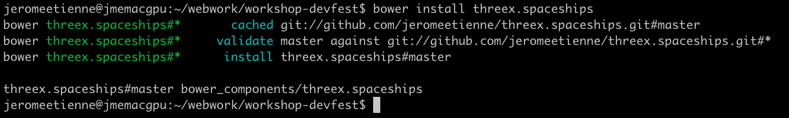

title: WebGL Workshop 
author:
  name: "Jerome Etienne"
  twitter: "@jerome_etienne"
  url: "http://jetienne.com"
output: index.html

--

# Flying Spaceships 
## A Game in THREE.js
  
--

### Using Yeoman ?

* Optional
* Much Faster with it tho
* and time is limited!

--

### Installing yeoman

```
sudo npm install -g yo
```

### Installing three.js Generator

```
sudo npm install -g generator-threejs-boilerplate
```

--

### Project Directory

#### create it

```
mkdir workshop-devfest
```

#### go in

```
cd workshop-devfest
```

--

### Generate Three.js Boilerplate

```
yo threejs-boilerplate
```


--

### Try Three.js Boilerplate

* Just a bunch of static files 

```
make server
```


--

### What is threex ?

* ultra light extension system for [three.js](http://mrdoob.github.io/three.js/)
* [threex](http://jeromeetienne.github.io/threex/) on github

--

### threex spaceships

* threex extensions for basic spaceships
* on github: [repo](https://github.com/jeromeetienne/threex.spaceships/) / 
[demo](http://jeromeetienne.github.io/threex.spaceships/examples/basic.html)

<iframe src='http://jeromeetienne.github.io/threex.spaceships/examples/basic.html' width='640px' height='480px'></iframe>

--

### Import threex spaceships

```
bower install threex.spaceships
```



--

### A textual example

Content can be written in **Markdown!** New lines no longer need two angle brackets.

This will be in a separate paragraph.


    
    


--

### A list of things

* Item 1
* Item B
* Item gamma

No need for multiple templates!

--

### Unicode

* 林花謝了春紅 太匆匆
* 胭脂淚 留人醉 幾時重
* Matching Pairs «»‹› “”‘’「」〈〉《》〔〕
* Greek αβγδ εζηθ ικλμ νξοπ ρςτυ φχψω
* currency  ¤ $ ¢ € ₠ £ ¥

--

### A code example

    // cool looking code
    var func = function (arg1) {
        return function (arg2) {
            return "arg1: " + arg1 + "arg2: " + arg2;
        };
    };

    console.log(func(1)(2)); // result is three